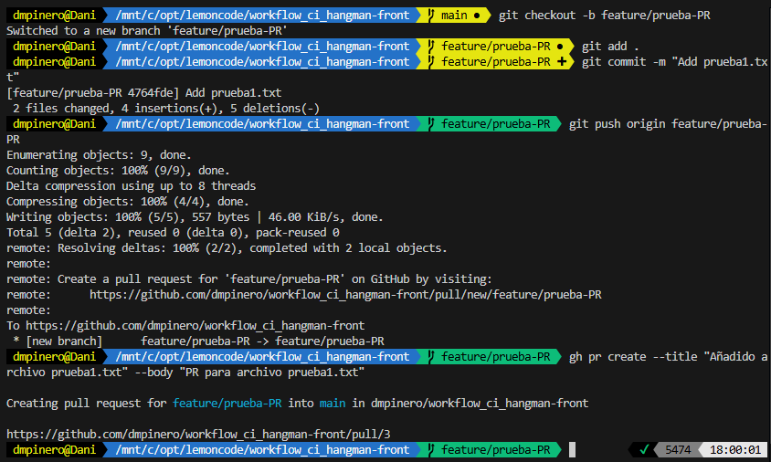
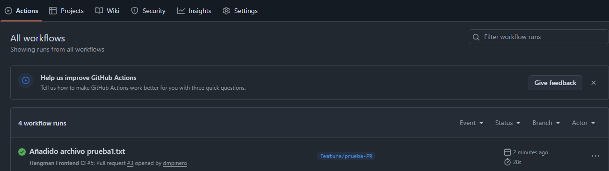
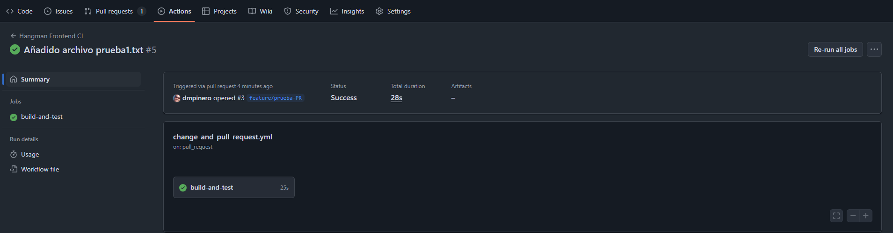
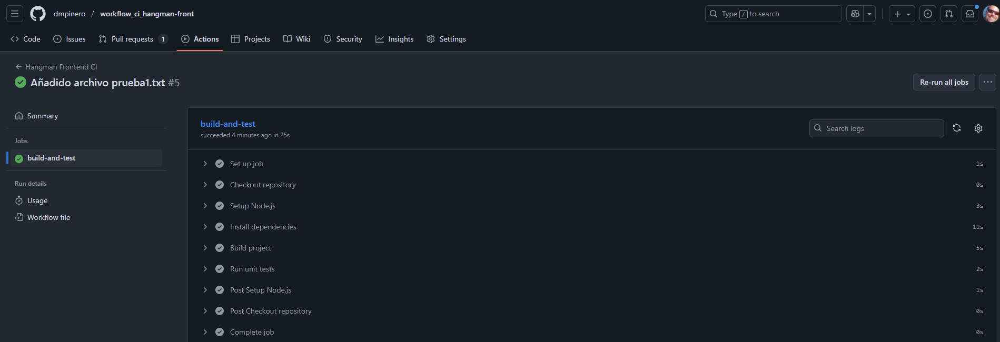

# Ejercicios GitHub Actions
## 1. Crea un workflow CI para el proyecto de frontend - OBLIGATORIO
Copia el directorio .start-code/hangman-front en el directorio raíz del mismo repositorio que usaste para las clases de GitHub Actions. Si no lo creaste, crea un repositorio nuevo.

Después crea un nuevo workflow que se dispare cuando haya cambios en el proyecto hangman-front y exista una nueva pull request (deben darse las dos condiciones a la vez). El workflow ejecutará las siguientes operaciones:

- Build del proyecto de front
- Ejecutar los unit tests

### Solución
En primer lugar he descargado la herramienta gh para poder realizar Pull Requests (PR) desde la terminal. Para ello he ejecutado el siguiente comando:
```bash
sudo apt install gh # Instala gh en Linux
```

Y he iniciado sesión en Github con el siguiente comando:
```bash
gh auth login # Inicia sesión en GitHub
```

A continuación, he creado el archivo .github/workflows/change_and_pull_request.yml con el siguiente contenido:
```yaml
name: Hangman Frontend CI

on:
  pull_request:
    paths: ["hangman-front/**"] # Solo se ejecuta cuando hay cambios en esta carpeta
    types: [opened, synchronize, reopened] # Se ejecuta al abrir, actualizar o reabrir PRs

jobs:
  build-and-test:
    runs-on: ubuntu-latest

    defaults:
      run:
        working-directory: ./hangman-front # Establece el directorio de trabajo

    steps:
      - name: Checkout repository
        uses: actions/checkout@v4 # Clona el repositorio

      - name: Setup Node.js
        uses: actions/setup-node@v4 # Configura Node.js
        with:
          node-version: '18'
          cache: 'npm' # Habilita el caché de npm
          cache-dependency-path: './hangman-front/package-lock.json'

      - name: Install dependencies
        run: npm ci # Instala dependencias de forma limpia

      - name: Build project
        run: npm run build # Ejecuta el build

      - name: Run unit tests
        run: npm test # Ejecuta los tests
```

He introducido un archivo de prueba dentro de la carpeta hangman-front denominado prueba1.txt y he ejecutado los siguientes comandos:
```bash
git checkout -b feature/prueba-PR # 1. Crear una nueva rama para tu feature
git add . * # Añade los archivos al staging area
git commit -m "Add prueba1.txt" # Realiza un commit
git push origin feature/prueba-PR # Sube los cambios al repositorio
gh pr create --title "Añadido archivo prueba1.txt" --body "PR para archivo prueba1.txt" # Crea una PR
```

* Creación de Pull Request (PR) desde la terminal



* Ejecución del workflow en la PR


* Resultado del workflow en la PR


* Resultado correcto del workflow en la PR


## 2. Crea un workflow CD para el proyecto de frontend - OBLIGATORIO
Crea un nuevo workflow que se dispare manualmente y haga lo siguiente:

- Crear una nueva imagen de Docker
- Publicar dicha imagen en el container registry de GitHub

### Solución
He creado el archivo .github/workflows/build_and_push_image.yml con el siguiente contenido:
```yaml
name: Hangman Frontend CD
on:
  workflow_dispatch: # Se ejecuta manualmente
jobs:
```